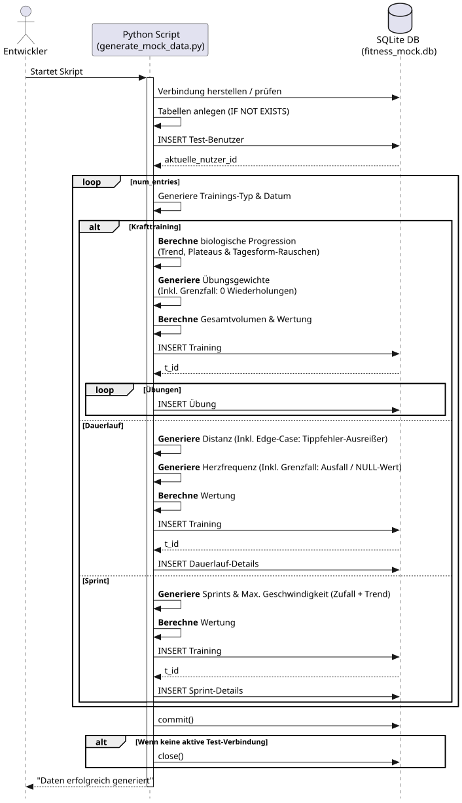
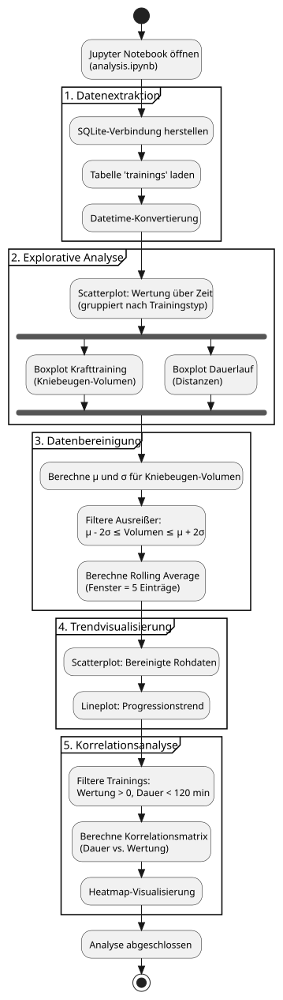

# Fitness-Data-Analyzer

Ein Python-basiertes Analyse- und Visualisierungstool für Trainingsdaten. Das Projekt demonstriert exemplarisch explorative Datenanalyse (EDA), statistische Ausreißerbereinigung und Trendvisualisierung an simulierten Fitness-Metriken.

## Projektkontext

Dieses Tool ist Teil eines zweiteiligen Portfolios:
- **Fitness-Tracker (CLI)**: Erfasst Trainingseinheiten via Kommandozeile und speichert sie in SQLite
- **Fitness-Data-Analyzer** (dieses Repository): Analysiert und visualisiert die Trainingsdaten

Die Verbindung beider Teile über eine API ist geplant. Der Analyzer arbeitet zu Test- und Präsentationszwecken mit synthetischen Daten, die eine realistische Leistungsprogression simulieren.

---

## Key Features

* **Synthetische Testdatengenerierung**: Simulation natürlicher Trainingsfortschritte durch kombinierte lineare Trends, periodische Plateaus (Sinusfunktion) und stochastisches Rauschen
* **Gezielte Anomalie-Injektion**: Bewusst platzierte Extremwerte (fehlerhafte Eingaben, Null-Werte) zur Demonstration robuster Datenverarbeitung
* **Explorative Visualisierung**: Identifikation von Ausreißern mittels Boxplots vor der statistischen Bereinigung
* **Statistische Datenbereinigung**: Filterung von Ausreißern über die zweifache Standardabweichung
* **Trendanalyse**: Glättung der Leistungsprogression durch Rolling Averages zur Darstellung langfristiger Entwicklungen
* **Korrelationsanalyse**: Untersuchung von Zusammenhängen zwischen Trainingsmetriken (Dauer vs. Wertung) mittels Heatmaps

---

## Tech Stack

* **Sprache**: Python 3.x
* **Datenverarbeitung**: `pandas`
* **Visualisierung**: `matplotlib`, `seaborn`
* **Datenbank**: SQLite3
* **Testing**: `pytest`, `unittest`

---

## Schnellstart

**Voraussetzungen:** Python 3.x, `pip`, `jupyter`

1. **Repo klonen und Abhängigkeiten installieren:**
```bash
   git clone https://github.com/39761/fitness-data-analyzer
   cd fitness-data-analyzer
   pip install -r requirements.txt
```

2. **Testdaten generieren:**
```bash
   python scripts/generate_mock_data.py
```
   *Erstellt `data/fitness_mock.db` mit 100 synthetischen Trainingseinheiten*

3. **Analyse-Notebook starten:**
```bash
   jupyter notebook notebooks/analysis.ipynb
```

---

## Projektstruktur

```
fitness-data-analyzer/
├── data/
│   └── fitness_mock.db           # Generierte SQLite-Datenbank
├── docs/
│   ├── generate_mock_data.puml   # Sequenzdiagramm Datengenerierung
│   ├── analysis_pipeline.puml    # Aktivitätsdiagramm Analyse-Pipeline
│   └── *.svg                     # Gerenderte Diagramme
├── notebooks/
│   └── analysis.ipynb            # Jupyter Notebook mit vollständiger EDA
├── scripts/
│   ├── data_provider.py          # Platzhalter für zukünftige API
│   └── generate_mock_data.py     # Testdatengenerator
├── tests/
│   ├── test_data_integrity.py    # Testet mathematische Zusammenhänge
│   ├── test_db_connection.py     # Testet DB-Zugriff
│   └── test_generator.py         # Testet Datengenerierung
├── README.md
└── requirements.txt
```

---

## Design-Entscheidungen

### Mathematische Progressions-Simulation

Die Testdaten bilden eine realistische Leistungsentwicklung ab, z. B. für Krafttrainings:

```python
progression = linear_trend + wave_pattern + noise
             = (day × 0.25) + sin(day/12) × 2.5 + rand(-5%, +5%)
```

**Komponenten:**
- **Linearer Trend**: Grundlegende Kraftzunahme über Zeit
- **Sinuswelle**: Periodische Plateaus und Leistungsschübe (ca. 40-Tage-Zyklen)
- **Stochastisches Rauschen**: Tagesform-Schwankungen von ±5%

**Anomalien** (gezielt eingebaut):
- Alle 30 Einträge: Krafttraining mit 0 Wiederholungen (Eingabefehler)
- Alle 25 Einträge: Dauerlauf mit 45 km statt ~5 km (Tippfehler)
- Alle 20 Einträge: Fehlende Herzfrequenz (`NULL`)

### Zwei Bereinigungsansätze

Das Tool demonstriert unterschiedliche Strategien im Umgang mit Ausreißern:

#### 1. Statistische Filterung (Progressionsanalyse)
Für die Trendanalyse der Kniebeugen-Progression:
- **Methode**: $\mu \pm 2\sigma$-Kriterium (zweifache Standardabweichung)
- **Begründung**: Mathematisch fundiertes Verfahren, das 95% der validen Werte behält
- **Anwendung**: Entfernt 0-kg-Einträge automatisch vor Berechnung des Rolling Average

#### 2. Heuristische Schwellenwerte (Korrelationsanalyse)
Für die Heatmap (Dauer vs. Wertung):
- **Methode**: Feste Grenzwerte (`wertung > 0`, `dauer_min < 120`)
- **Begründung**: Fokussiert die Korrelationsmatrix auf den relevanten Leistungskorridor
- **Anwendung**: Schließt unvollständige Trainings und Zeitausreißer manuell aus

---

## Architektur & Dokumentation

### Datengenerierungs-Prozess (Sequenzdiagramm)

Das bestehende Sequenzdiagramm `generate_mock_data.puml` visualisiert den Ablauf des Generators. Es zeigt:
- Tabellenerstellung mit Foreign-Key-Constraints
- Schleife über alle Trainingstypen
- Berechnung der biologischen Progression
- Gezielte Injection von Anomalien
- Transaktionales Commit der Daten



### Analyse-Pipeline (Aktivitätsdiagramm)



Dieses Diagramm zeigt den sequenziellen ETL-Prozess im Notebook: Extraktion aus SQLite, explorative Visualisierung, statistische Bereinigung und finale Korrelationsanalyse.

### Konzeptionelle Zielarchitektur

**Langfristige Vision**: Überbrückung zwischen CLI-Tracker und Analyzer via REST-API

**Aktuell**:
```
[CLI-Tracker] → fitness_tracker.db (lokal)
[Analyzer]    → fitness_mock.db (synthetisch, lokal)
```

**Ziel** (noch nicht implementiert):
```
[CLI-Tracker]
      ↓
fitness_tracker.db (lokal)
      ↓
POST /api/trainings
      ↓
[FastAPI Layer]
      ↓
[Zentrale DB]
      ↓
[Analyzer Pipeline]
```

---

## Testing

**Tests ausführen:**
```bash
python -m pytest tests/ -v
```

**Test-Abdeckung:**

| Datei | Zweck | Kernprüfungen |
|-------|-------|---------------|
| `test_generator.py` | Datengenerierung | Tabellenerstellung, Progressionsformel, Zeilen-Insertion |
| `test_db_connection.py` | DB-Integration | SQLite-Lese/Schreibzugriffe, Pandas-Kompatibilität |
| `test_data_integrity.py` | Datenqualität | Wertungs-Formel (Volumen/20), FK-Konsistenz |

**Besonderheit**: `test_generator.py` nutzt In-Memory-DB (`:memory:`) für schnelle, isolierte Tests ohne Dateisystem-Abhängigkeiten.

---

## Bekannte Einschränkungen

- **Keine echten Daten**: Alle Analysen basieren auf synthetischen Mustern
- **SQLite-Limitierungen**: Keine gleichzeitigen Schreibzugriffe (Notebook blockiert Generator)
- **Fehlende API**: `data_provider.py` ist ein leerer Platzhalter
- **Hartcodierte Werte**: Progressionsparameter (0.25, 2.5, 12) sind nicht konfigurierbar

---

## Ausblick

### Geplante Erweiterungen

1. **REST-API mit FastAPI**
   - Endpunkte: `POST /trainings`, `GET /statistics/{user_id}`
   - Pydantic-Validierung eingehender Trainingsdaten
   - Entkopplung von lokalen `.db`-Dateien

2. **Produktive Datenbank**
   - Migration von SQLite zu PostgreSQL/MySQL
   - Trennung: Transaktionale DB (Tracker) ↔ Analytische DB (Analyzer)

3. **Erweiterte Analysen**
   - Anomalie-Detection via ML (Isolation Forest, LOF)
   - Forecasting zukünftiger Leistungen (ARIMA, Prophet)
   - Vergleichsanalysen zwischen mehreren Nutzern

---

## Lizenz

Dieses Projekt wurde zu Bildungszwecken als Teil eines technischen Portfolios erstellt.  
Frei zur Nutzung und Modifikation für nicht-kommerzielle Zwecke.